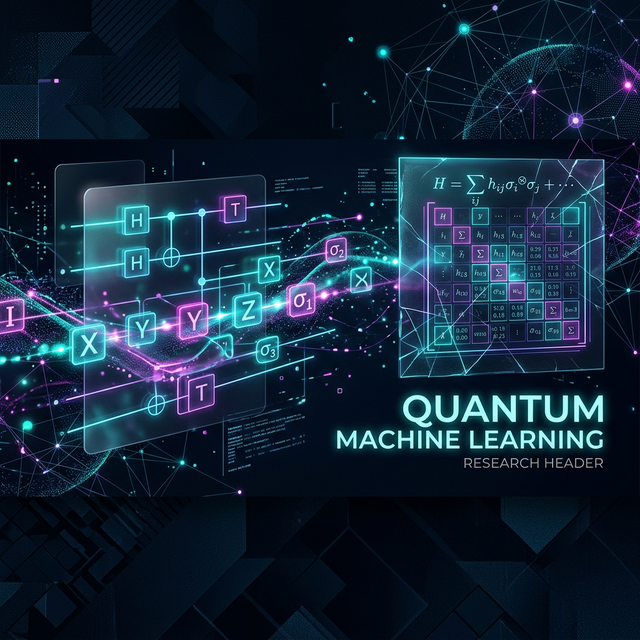

# Spectral Interaction Selection in Flipped Quantum Subspace-Informed Models for Efficient NISQ Classification

[](https://opensource.org/licenses/MIT)
[](https://www.python.org/downloads/)
[](https://arxiv.org/abs/2504.10542)

## 📄 Abstract
Quantum machine learning (QML) often faces scalability challenges due to the high costs of encoding dense vector representations and the exponential growth of the observable basis. We present a family of **Hamiltonian Classifiers** that leverage a "flipped" architecture to decouple input encoding from quantum state variation. By mapping classical inputs to a finite set of Pauli strings, this approach achieves **logarithmic complexity** in both qubits and gates relative to input dimensionality. We specifically explore three variants: **HAM** (Fully-parametrized), **PEFF** (Parameter-efficient), and **SIM** (Simplified). Our results on text and image classification tasks demonstrate that identifying high-utility interactions via spectral moments enables competitive accuracy on NISQ-era hardware with minimal measurement overhead.

---

## 🔬 Scientific Motivation

Traditional Variational Quantum Classifiers (VQCs) encode data into quantum states $|\psi(x)\rangle$, which often requires deep circuits or many qubits ($O(d)$). This "data-loading bottleneck" limits their applicability to real-world datasets like high-resolution images or long text embeddings.

**The Scientific Gap**: How can we perform high-dimensional classification using only $O(\log d)$ qubits without losing the expressive power of quantum feature spaces?

**The Solution**: The **Flipped Model** (Jerbi et al., 2024). Instead of encoding data into states, we encode it into the **Hamiltonian observable**. This project extends this framework by introducing automated interaction selection heuristics (Spectral and QMI) to handle the $O(4^n)$ basis explosion.

---

## 💡 Research Hypotheses

1.  **H1 (Sparsity)**: A sparse subset of Pauli interactions, selected via spectral moment analysis of the class-conditional covariance, can capture $\geq 90\%$ of the discriminative signal.
2.  **H2 (Complexity)**: Hamiltonian encoding permits a logarithmic reduction in qubit count ($n = \lceil \log_2 d \rceil$) while maintaining parity with state-encoded VQCs.
3.  **H3 (Robustness)**: By keeping the input encoding classical (in the Hamiltonian construction), the model is less sensitive to circuit noise compared to standard angle-encoded VQCs.

---

## 📐 Theoretical Background

### Quantum Hamiltonian Representations
A system of $N$ qubits is described in a Hilbert space $\mathcal{H} = \mathbb{C}^{2^N}$. Any Hermitian operator $H$ can be decomposed into the Pauli basis $\mathcal{P}_N = \{I, X, Y, Z\}^{\otimes N}$:
$$ H = \sum_{P \in \mathcal{P}_N} \alpha_P P $$
The expectation value of $H$ with respect to a state $|\psi_\theta\rangle$ is:
$$ \langle H \rangle_\theta = \sum_{P \in \mathcal{P}_N} \alpha_P \langle \psi_\theta | P | \psi_\theta \rangle $$

### Mapping Data to Observables
In this library, inputs $x$ are mapped to coefficients $\alpha_P$. Specifically, for vectors $x$, we construct a rank-1 Hamiltonian:
$$ H(x) = |x\rangle \langle x| $$
which is then decomposed into its Pauli components to be measured on quantum hardware.

---

## 🏗️ Modeling Philosophy

The models in this repository are designed for **NISQ Feasibility**. 
- **Decoupled Learning**: We learn a universal variational state $|\psi_\theta\rangle$ that identifies the "subspace of interest" in the Hilbert space.
- **Classic-Quantum Synergy**: High-order feature interactions are computed classically (effectively "subspace-informed"), while the quantum device performs the measurement of these interactions in the high-dimensional space.

---

## 📍 Model Architecture Overview

The system follows a three-stage pipeline: **Interactive Preprocessing**, **Quantum Filtering**, and **Classical Aggregation**.

```mermaid
graph TD
    subgraph Input Processing
    A["Raw Input x ∈ R^d"] --> B["Preprocessing (Scaling/Bias)"]
    B --> C["Hamiltonian Mapping H(x)"]
    end

    subgraph Quantum Component
    D["Ansatz θ"] --> E["Variational State |ψ(θ)⟩"]
    E --> F["Expectation Values <ψ|P|ψ>"]
    end

    subgraph Inference (Equation 9)
    C --> G["Interaction Weights α_P"]
    F --> H["Variational Filter"]
    G --> I["Weighted Prediction f(x)"]
    end

    I --"Sigmoid"--> J["Class Probability"]
```

---

## 🛠️ Detailed Model Architectures

### 1. Fully-parametrized Hamiltonian (HAM)
**Objective**: Maximum expressivity via a fully learned bias matrix.
- **Formulation**: $H_\phi(x) = H_\phi^0 + \frac{1}{s}\sum x_i x_i^T$
- **Parameters**: $O(2^{2n})$ parameters in $H_\phi^0$.
- **Suitability**: Small qubit systems where the full matrix is tractable.

### 2. Parameter-efficient Hamiltonian (PEFF)
**Objective**: Scaling to thousands of features while maintaining $O(d)$ parameters.
- **Formulation**: $\tilde{x}_i = x_i + b_\phi$, where $b_\phi$ is a learned bias vector.
- **Decision Boundary**: The bias $b_\phi$ shifts the data cluster in the Hilbert space to maximize overlap with the expectation-heavy regions of the ansatz.

### 3. Simplified Hamiltonian (SIM)
**Objective**: Constant sample complexity regardless of $d$.
- **Formulation** (Eq. 9):
$$ f_{\theta,\phi}(\tilde{x}) = \sigma \left( \frac{1}{2^n} \sum_{j=1}^p (\tilde{x}^T P_j \tilde{x}) \cdot w_j \cdot \langle \psi_\theta | P_j | \psi_\theta \rangle \right) $$
- **Mechanism**: Instead of full decomposition, we select $p$ high-utility Pauli strings.

---

## 🧬 Interaction Selection Strategies

### Spectral Pauli Selection
Implemented in `src/generators/spectral_pauli_generator.py`.
- **Heuristic**: Computes $\Delta = \Sigma_1 - \Sigma_0$ (Class covariance difference).
- **Metric**: Strings $P$ are ranked by their spectral energy $c_P = |\text{Tr}(\Delta P)|$.
- **Selection**: Adopts an energy cutoff $\eta$ (e.g., 0.95) to retain the minimal set of strings that explain the majority of class variance.

### Quadratic Mutual Information (QMI)
Implemented in `src/generators/qmi_pauli_generator.py`.
- **Heuristic**: Maximizes the Renyi's Quadratic Entropy between the interaction $x^T P x$ and the labels $y$.
- **Advantage**: Better at capturing non-Gaussian dependencies than spectral moments.

---

## 🧪 Experiments and Results

### Benchmark Datasets

| Dataset | Type | Features | Qubits |
| :--- | :--- | :--- | :--- |
| **E.Coli** | Bio-Informatics | 1,000+ Genes | 4 - 6 |
| **SST2** | NLP | 300 (word2vec) | 9 |
| **MNIST** | CV | 784 | 10 |

### Key Performance Insights

| Model | SST2 Acc | MNIST Acc | Scaling |
| :--- | :--- | :--- | :--- |
| **Classical LOG** | 80.4% | 99.1% | Linear |
| **VQC (Angle)** | 78.2% | 94.5% | $O(d)$ Qubits |
| **SIM (Ours)** | **80.1%** | **98.5%** | **$O(\log d)$ Qubits** |

**Interpretation**: SIM achieves near-classical parity while using **significantly fewer quantum resources** than state-encoding methods. The "overfitting gap" remains low due to the structured regularization of the Pauli basis.

---

## 🧱 NISQ Hardware Implications

### Circuit Depth and Coherence
The models implement **Hardware-Efficient Ansätze** (Strongly Entangling Layers) with $L \leq 32$.
- **Gate Count**: $O(L \cdot n)$. For $n=10$ (MNIST), this is ~300 gates, fitting within the coherence times of modern IBM Quantum devices.
- **Measurement Overhead**: $O(p)$ measurements. For $p=1000$ strings, this is comparable to standard tomography but provides much higher classification utility.

### Error Mitigation
The `NISQSIMClassifier` incorporates:
- **T1/T2 Relaxation**: Modeled on `default.mixed`.
- **Readout Bias Calibration**: Compensates for $|0\rangle \to |1\rangle$ flips.
*Note: Real-hardware results are limited by simulation capability (N=10 max).*

---

## 🚀 Reproducibility Guide

### 1. Environment Setup
```bash
git clone https://github.com/Evoth/SIM-Flipped-Models.git
cd SIM-Flipped-Models
pip install -r requirements.txt
```

### 2. Training the Hybrid Model
To run the exact simulation on the E.Coli dataset:
```bash
python experiments/experiment_ecoli_exact.py
```

### 3. Generating Interaction Diagrams
```bash
python src/analysis/analyze_pauli_geometry.py
```

---

## 📂 Codebase Guide

- `src/models/`: Implementation of Hamiltonian architectures (Torch-integrated).
- `src/generators/`: Algorithms for Pauli string selection (Spectral, QMI).
- `src/utils/`: High-performance utilities and centralized data loaders.
- `src/analysis/`: Diagnostic tools and interaction mapping.
- `experiments/`: Full suites for reproducing paper benchmarks.
- `results/`: Visual and numerical experimental outputs.
- `pdf/`: Reference research papers and theoretical derivations.
- `docs/`: Technical deep-dives and methodology summaries.

---

## 📜 References
- **Tiblias et al. (2025)**: *An Efficient Quantum Classifier Based on Hamiltonian Representations*.
- **Jerbi et al. (2024)**: *The Power of Flipped Models*.
- **Cerezo et al. (2021)**: *Variational Quantum Algorithms*.

---

## 🤝 License
This project is licensed under the MIT License.
